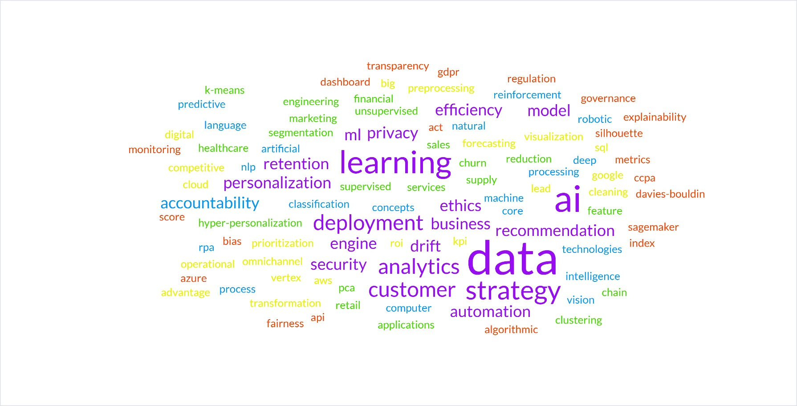
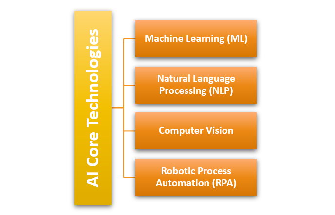
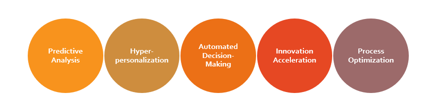
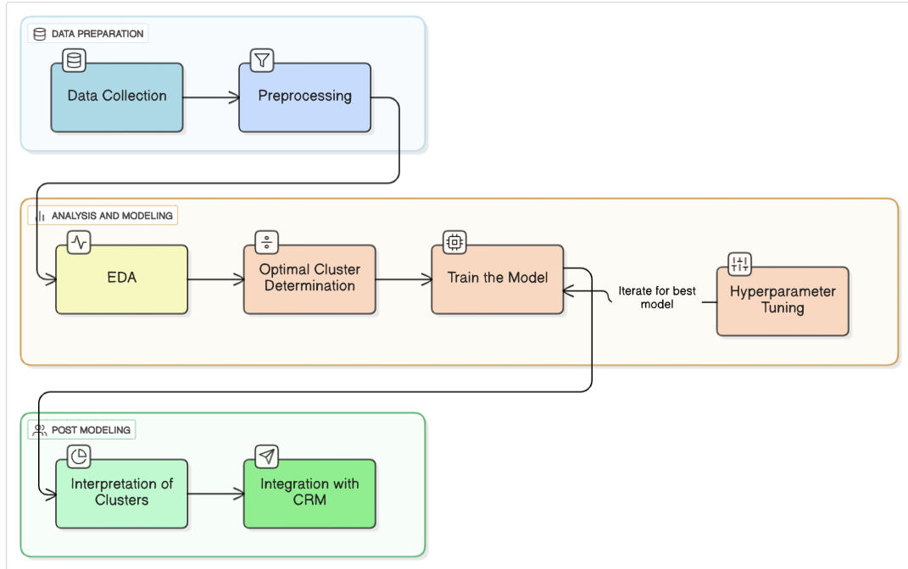
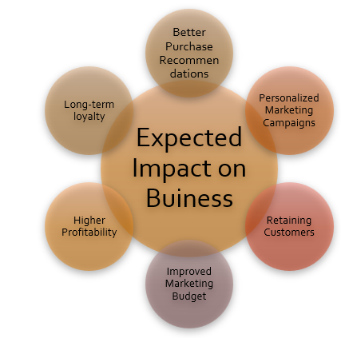
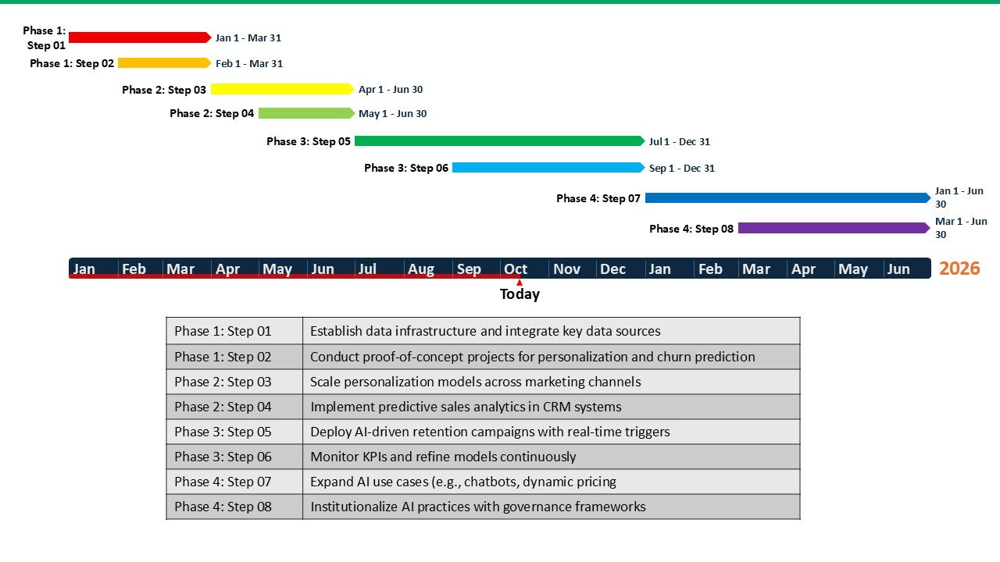
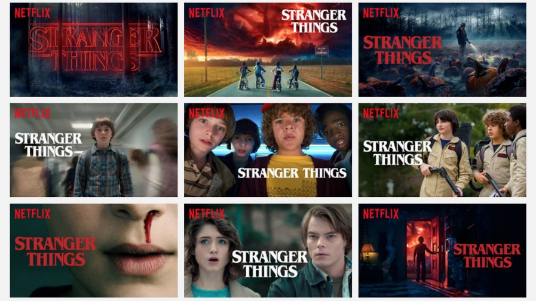
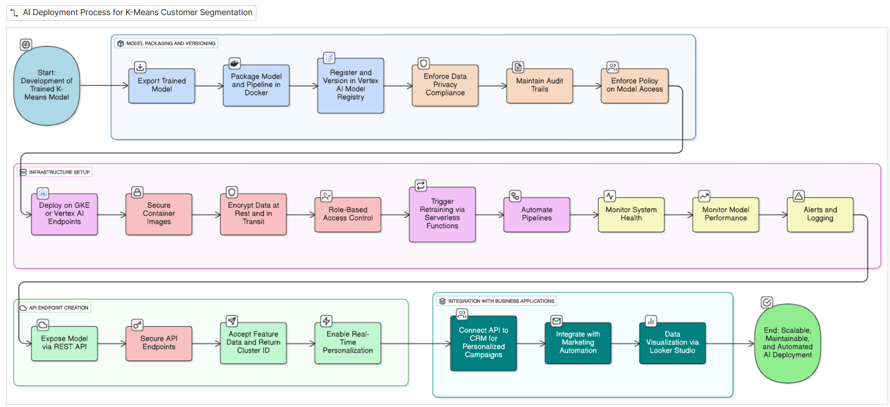

# Zamruth Nizar – Customer Service Meets AI Portfolio

---

## 📝 About Me

I am a **detail-oriented, customer-centric professional** with over **14 years of experience** in client-facing roles across education, e-commerce, and remote support environments. I specialize in:

- Delivering excellent customer service with empathy and efficiency  
- Managing complex workflows and operations  
- Coaching teams and ensuring performance excellence  

I have recently embarked on a journey to explore **Artificial Intelligence (AI) for business solutions**, focusing on **data-driven insights, process optimization, and enhancing customer experiences**. I am excited to apply AI solutions in real-world business challenges and continuously grow in this emerging field.

---

## 🎯 Purpose of this Portfolio

This portfolio demonstrates:

1. **Professional Experience:** My career in customer support, academic operations, and leadership roles.  
2. **Project Showcase:** AI-related projects reflecting my learning journey.  
3. **Skills Development:** Operational, technical, and AI-related competencies.  
4. **References & Research:** Supporting academic and industry references in AI applications.  

It bridges **customer service expertise with AI-driven business solutions**, highlighting my ability to leverage AI to improve workflows and enhance customer experiences.

---

## 💼 Portfolio Structure

### 1. Profile
- Overview of professional experience, interests, and AI journey.  
- Focus on **customer service excellence**, operations management, and my current **learning path in AI solutions**.

### 2. Experience
- **Customer Support – Shift Lead, Enliven Designers | 2023 – Present**  
  - Lead afternoon shift customer support team for e-commerce platforms.  
  - Conduct QA reviews, maintain brand tone, and ensure service accuracy.  
  - Train team members on KPIs and PIPs for performance improvements.  
  - Manage inventory operations across global warehouses and optimize workflows.

- **Student Administrator, British School of Commerce | 2017 – 2023**  
  - Managed admissions, orientations, and academic records for UK university programs.  
  - Handled high-volume student queries and complaint resolution.  
  - Streamlined communication channels between students and faculty.

- **Academic Operations Manager, Skills College of Technology | 2016 – 2017**  
  - Oversaw operations across five campuses for consistency in student services.  
  - Coordinated ERP deployment, improving transparency and efficiency.  

---

### 3. Project Showcase

<section id="projects" class="container">
  <h2>💼 Project Showcase</h2>

  

    <h3>📘 Task 01 – Fundamental AI Concepts and Their Strategic Importance</h3>
    
This task introduced the foundational principles of AI and explored how organizations leverage AI for competitive advantage. It covered the role of AI in business transformation, decision-making, and ethical responsibility. Students learned to evaluate AI's strategic importance in modern enterprises and identify opportunities for AI-driven value creation.

    <ul>
      <li><strong>Key Learnings:</strong> Strategic importance of AI, business value creation, ethical frameworks.</li>
      <li><a href="./pdfs/task01_report.pdf">📄 View PDF Report</a></li>
      <li>🖼️ Images:
         
         
         
      </li>
    </ul>
  

  

    <h3>🛍️ Task 02 – Application of AI Techniques and Tools in Customer Segmentation</h3>
    
This project implemented <strong>K-Means clustering</strong> to segment retail customers based on purchasing behavior. The project involved **data collection, preprocessing, feature engineering, clustering, and analysis**, demonstrating how AI can inform targeted marketing and customer personalization strategies.

    <ul>
      <li><strong>Key Learnings:</strong> Machine learning workflow, clustering validation, data-driven marketing, customer segmentation strategies.</li>
      <li><a href="./pdfs/task02_report.pdf">📄 View PDF Report</a></li>
      <li>🖼️ Images:
         
         
      </li>
    </ul>
  

  

    <h3>🎬 Task 03 – AI-Driven Business Strategy and Netflix Case Study Analysis</h3>
    
Analyzed Netflix’s use of AI for <strong>personalization, content recommendation, and engagement optimization</strong>. This project emphasized the implementation of **recommendation algorithms, A/B testing, and user behavior analytics**, highlighting AI's role in improving customer engagement and strategic business decisions.

    <ul>
      <li><strong>Key Learnings:</strong> Recommendation algorithms, user retention, content personalization, data ethics in media streaming.</li>
      <li><a href="./pdfs/task03_report.pdf">📄 View PDF Report</a></li>
      <li>🖼️ Images:
         
         
         
      </li>
    </ul>
  

  

    <h3>💻 Task 04 – AI Solution Deployment and Professional Portfolio</h3>
    
Designed an AI deployment strategy and created this portfolio website as a showcase of academic and practical achievements. This task emphasized **end-to-end deployment, solution evaluation, and professional presentation**, demonstrating how AI knowledge translates into tangible business tools.

    <ul>
      <li><strong>Key Learnings:</strong> End-to-end model lifecycle, deployment strategies, portfolio design, self-branding, and solution communication.</li>
      <li><a href="./pdfs/task04_report.pdf">📄 View PDF Report</a></li>
      <li>🖼️ Images:
         
      </li>
    </ul>
  

</section>

---

### 4. Skills & Technical Proficiency

- **Customer Service & Communication:** Live chat, email, social media, conflict resolution, tone consistency.  
- **Operations & Administration:** Workflow design, student lifecycle management, ERP & LMS systems.  
- **Leadership & Training:** Team supervision, performance reviews, coaching & mentoring.  
- **Technical Tools:** Python, Excel, Google Workspace, Microsoft Office, CRM & ERP platforms, ShipStation, Zendesk, Richpanel, Prism, AX, CPR systems.  
- **AI & Analytics:** Data preprocessing, K-Means clustering, A/B testing, recommendation systems, machine learning workflow.  
- **Languages:** English (Fluent), Sinhala (Fluent), Tamil (Basic).  

---

### 5. References

A comprehensive list of academic and industry references supporting AI and business applications:

- Aagaard, A. and Tucci, C., 2024. *AI-driven business model innovation: pioneering new frontiers in value creation*. Springer International Publishing.  
- Abishek, M.N. and Judi, E.K., 2025. *Exploring Consumer Engagement with AI-Driven Experiences on Netflix Streaming Platform*.  
- Adedokun, A., 2024. *Global AI regulatory landscape: trends and future outlook.*  
- Afrin, S., Roksana, S. and Akram, R., 2024. *AI-enhanced robotic process automation: intelligent automation innovations.* IEEE Access.  
- [Full reference list continues with all sources included in your project.]  

